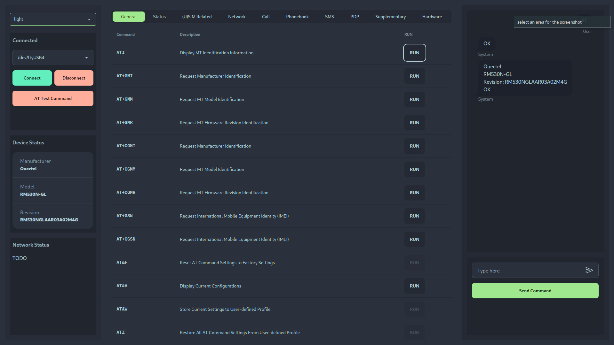
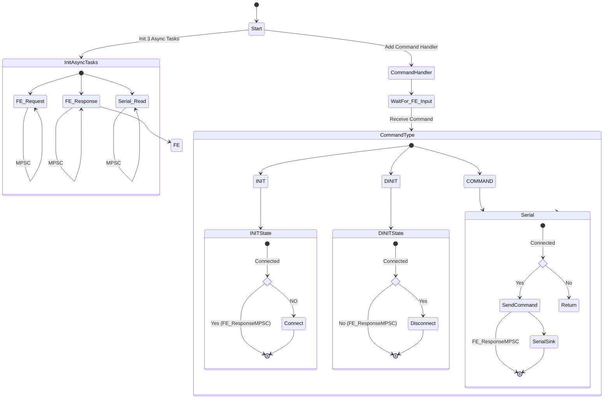

# AT UI

**AT UI** is an interface for sending, receiving, and processing AT commands over UART. This is for debugging and communication with devices AT Sim Modules connected over USB.

## Features (WIP)

- Send AT commands and view responses in real-time.
- Customizable command presets for efficient testing.
- Intuitive UI for monitoring UART communication.
- Easy-to-configure baud rate and connection settings (BaudRate is TBA).

## Status

This project is a **Work in Progress (WIP)** and actively under development. Contributions and feedback are welcome!

## ToDo:
- [ ] Add some sort of AT Reply-Response Mock for testing
    - Helps with testing the UI without needing to connect to a device as sometime it needs root access
- [ ] Add input boxes to the UI for AT commands that require additional input. 

## Screenshots

### Connecting

### Send ATI Command

## Recommended IDE Setup

- [VS Code](https://code.visualstudio.com/) + [Tauri](https://marketplace.visualstudio.com/items?itemName=tauri-apps.tauri-vscode) + [rust-analyzer](https://marketplace.visualstudio.com/items?itemName=rust-lang.rust-analyzer)

### To get started run:

- cd atui
- pnpm install
- pnpm tauri android init

For Desktop development, run:

- pnpm tauri dev

For Android development, run:

- pnpm tauri android dev

# atui

